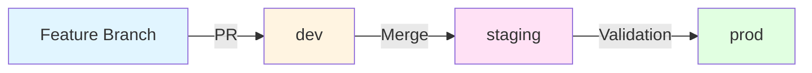
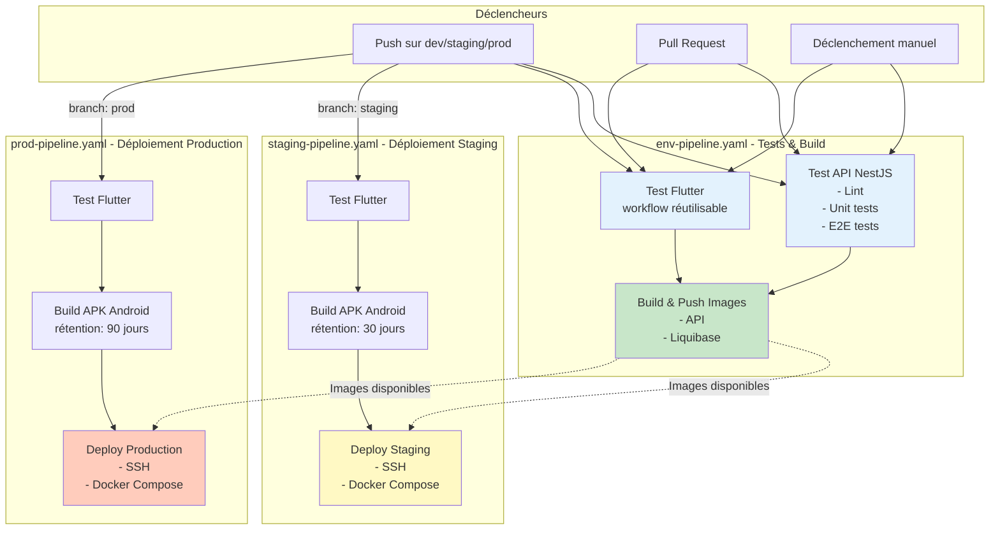
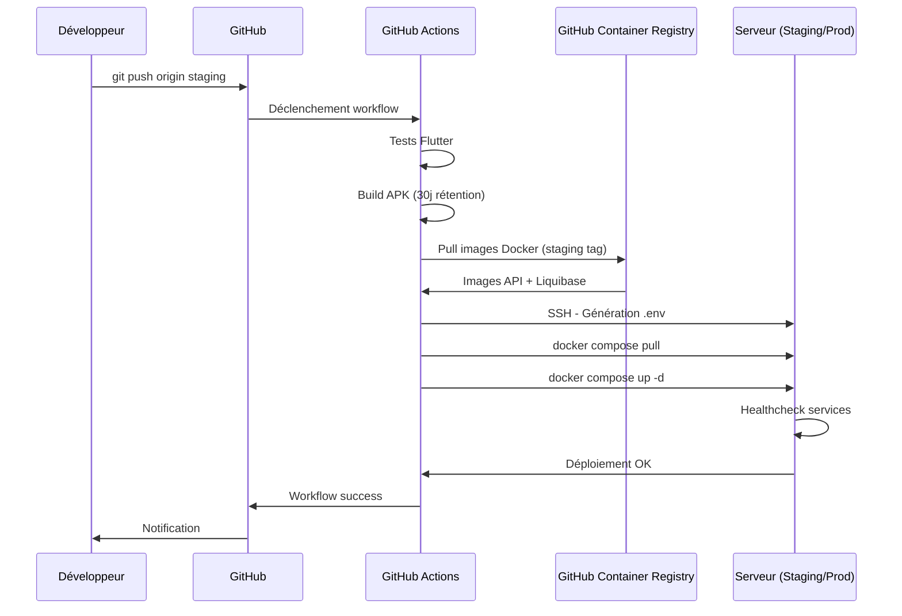
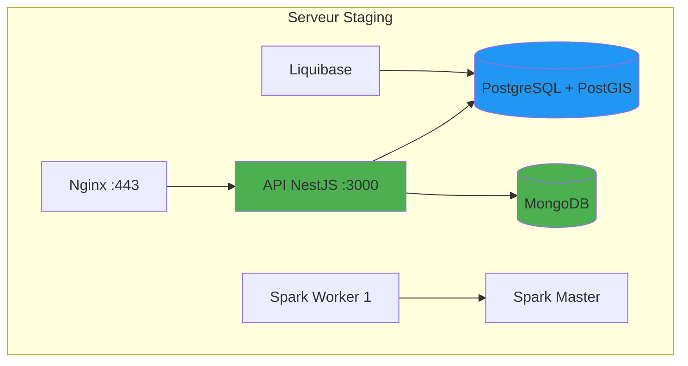
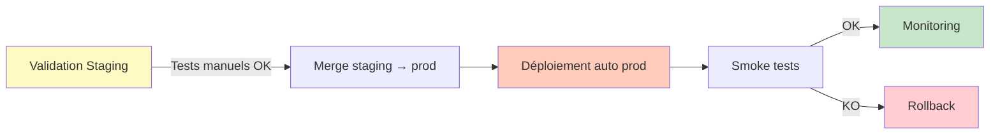
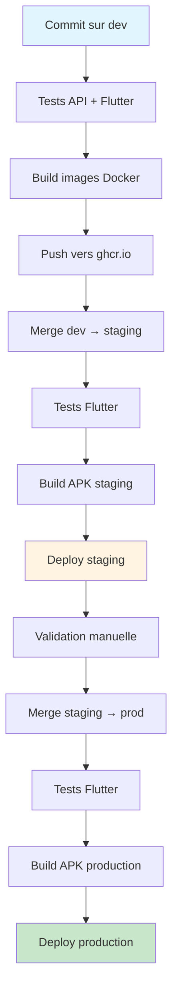

# Documentation CI/CD - BeeSure

## Table des matières

- [Vue d'ensemble](#vue-densemble)
- [Stratégie de branching](#stratégie-de-branching)
- [Architecture des pipelines](#architecture-des-pipelines)
- [Workflows détaillés](#workflows-détaillés)
  - [env-pipeline.yaml](#env-pipelineyaml)
  - [staging-pipeline.yaml](#staging-pipelineyaml)
  - [prod-pipeline.yaml](#prod-pipelineyaml)
  - [Workflows réutilisables](#workflows-réutilisables)
- [Optimisations et bonnes pratiques](#optimisations-et-bonnes-pratiques)
- [Gestion des artefacts](#gestion-des-artefacts)
- [Variables et secrets](#variables-et-secrets)
- [Déploiement](#déploiement)

---

## Vue d'ensemble

Le projet BeeSure utilise **GitHub Actions** pour automatiser l'ensemble du cycle de vie du développement, des tests jusqu'au déploiement en production. L'infrastructure repose sur :

- **Backend** : API NestJS (Node.js 22)
- **Mobile** : Application Flutter
- **Databases** : PostgreSQL + PostGIS, MongoDB
- **Big Data** : Apache Spark
- **Migrations** : Liquibase
- **Container Registry** : GitHub Container Registry (ghcr.io)
- **Orchestration** : Docker Compose

### Flux global

```
Commit → Tests → Build → Push Images → Deploy
```

---

## Stratégie de branching

### GitFlow adapté

Le projet suit une stratégie de branching basée sur GitFlow avec trois branches principales :

| Branche | Rôle | Déploiement automatique | Environnement |
|---------|------|------------------------|---------------|
| `dev` | Développement actif | Non | Développement local |
| `staging` | Pré-production | Oui | Serveur staging |
| `prod` | Production | Oui | Serveur production |

### Workflow de développement



### Règles de promotion

1. **Développement** : Les features sont mergées dans `dev` via Pull Request
2. **Staging** : Merge `dev` → `staging` après validation des tests
3. **Production** : Merge `staging` → `prod` après validation en staging

---

## Architecture des pipelines

### Diagramme complet du flux CI/CD



### Cycle de vie d'un commit



---

## Workflows détaillés

### env-pipeline.yaml

**Déclenchement** :
- Push sur `dev`, `staging`, `prod`
- Pull Request vers `dev`, `staging`, `prod`
- Manuel (`workflow_dispatch`)

**Jobs** :

#### 1. test-api

Tests de l'API NestJS exécutés dans un conteneur Docker.

```yaml
Stratégie:
- Build image Docker multi-stage (target: builder)
- Cache GitHub Actions pour optimiser les builds
- Exécution des tests dans le conteneur
```

**Étapes** :

1. **Build test image** :
   - Utilise `docker/Dockerfile.api.prod` avec target `builder`
   - Cache : `type=gha,scope=test-api`
   - Tag : `api-test:latest`
   - Pas de push (juste load local)

2. **Run linter** :
   ```bash
   docker run --rm api-test:latest npm run lint
   ```

3. **Run unit tests** :
   ```bash
   docker run --rm api-test:latest npm test
   ```

4. **Run e2e tests** :
   ```bash
   docker run --rm api-test:latest npm run test:e2e
   ```

**Avantages** :
- Tests dans un environnement identique à la production
- Isolation complète
- Reproductibilité garantie
- Pas de pollution de l'environnement CI

#### 2. test-flutter

Appelle le workflow réutilisable `flutter-test.yaml`.

```yaml
uses: ./.github/workflows/flutter-test.yaml
```

**Détails** : Voir [Workflows réutilisables](#workflows-réutilisables)

#### 3. build-and-push

Construit et publie les images Docker sur GitHub Container Registry.

**Conditions d'exécution** :
- ✅ Uniquement sur `push` (pas sur PR)
- ✅ Après succès de `test-api` et `test-flutter`

**Pourquoi pas sur PR ?**
- Évite de polluer le registry avec des images de test
- Réduit les coûts de stockage
- Les PR sont testées mais pas buildées
- Le build complet se fait uniquement lors du merge

**Images construites** :

##### API Image

```yaml
Tags générés:
- ghcr.io/owner/repo/api:dev (branche)
- ghcr.io/owner/repo/api:dev-abc1234 (branche-SHA)
```

**Build multi-stage** :
- Stage `deps` : Dépendances production uniquement
- Stage `builder` : Build de l'application
- Stage `production` : Image finale minimale

**Optimisations** :
- Cache GitHub Actions : `type=gha,scope=api`
- Utilisateur non-root pour la sécurité
- Image Alpine pour réduire la taille
- Healthcheck intégré

##### Liquibase Image

```yaml
Tags générés:
- ghcr.io/owner/repo/liquibase:staging
- ghcr.io/owner/repo/liquibase:staging-abc1234
```

**Stratégie de tagging** :

| Type de tag | Format | Exemple | Usage |
|-------------|--------|---------|-------|
| Branch | `branch` | `dev`, `staging`, `prod` | Tag mutable, pointe toujours vers le dernier commit |
| Branch+SHA | `branch-sha` | `dev-abc1234` | Tag immutable, référence exacte |

---

### staging-pipeline.yaml

**Déclenchement** :
- Push sur `staging`
- Manuel (`workflow_dispatch`)

**Jobs** :

#### 1. test-flutter

Tests Flutter via workflow réutilisable.

#### 2. build-apk

Construit l'APK Android pour staging.

```yaml
Paramètres:
- artifact-name: android-apk-staging
- retention-days: 30
```

**Artefact** :
- Nom : `android-apk-staging`
- Chemin : `apps/mobile_app/build/app/outputs/flutter-apk/app-release.apk`
- Rétention : 30 jours

#### 3. deploy-staging

Déploie sur le serveur staging via SSH.

**Environnement GitHub** :
```yaml
environment:
  name: staging
  url: ${{ secrets.STAGING_URL }}
```

**Processus de déploiement** :

1. **Génération du fichier .env** :
   - Créé dynamiquement à partir des secrets GitHub
   - Contient toutes les variables d'environnement (DB, JWT, CORS, etc.)
   - Permet de centraliser la configuration

```bash
cat > .env << EOF
GITHUB_REPOSITORY=${{ github.repository }}
IMAGE_TAG=staging
NODE_ENV=staging
# ... autres variables
EOF
```

2. **Login au registry** :
   ```bash
   echo ${{ secrets.GITHUB_TOKEN }} | docker login ghcr.io -u ${{ github.actor }} --password-stdin
   ```

3. **Pull des images** :
   ```bash
   docker compose -f docker-compose.prod.yml pull
   ```
   - Récupère les images taguées `staging` depuis ghcr.io

4. **Restart des services** :
   ```bash
   docker compose -f docker-compose.prod.yml up -d
   ```
   - Redémarre tous les services avec les nouvelles images
   - Mode détaché (`-d`)

5. **Nettoyage** :
   ```bash
   docker image prune -af
   ```
   - Supprime les anciennes images non utilisées
   - Libère de l'espace disque

**Architecture déployée** :



---

### prod-pipeline.yaml

**Déclenchement** :
- Push sur `prod`
- Manuel (`workflow_dispatch`)

**Différences avec staging** :

| Aspect | Staging | Production |
|--------|---------|------------|
| Tag image | `staging` | `prod-{SHA}` |
| Rétention APK | 30 jours | 90 jours |
| Artifact name | `android-apk-staging` | `android-apk-production` |
| Secrets | `STAGING_*` | `PROD_*` |
| Environment | `staging` | `production` |

**Mesures de sécurité supplémentaires** :

1. **Tag immutable** :
   - Production utilise `prod-{SHA}` pour garantir la traçabilité
   - Impossible de "ré-écrire" un tag par accident
   - Audit trail complet

2. **Protection de branche** :
   - Recommandé : activer les protections sur `prod`
   - Require review avant merge
   - Status checks requis

3. **Environment Protection Rules** (GitHub) :
   - Reviewers requis
   - Délai de déploiement configurable
   - Restriction d'accès

**Workflow recommandé** :



---

### Workflows réutilisables

#### flutter-test.yaml

**Type** : `workflow_call` (réutilisable)

**Étapes** :

1. Setup Flutter
   - Version : `3.35.7`
   - Channel : `stable`
   - Cache activé

2. Install dependencies
   ```bash
   cd apps/mobile_app && flutter pub get
   ```

**Avantages de la réutilisation** :

✅ **DRY (Don't Repeat Yourself)** :
- Défini une seule fois
- Utilisé dans env-pipeline, staging-pipeline, prod-pipeline
- Modification centralisée

✅ **Maintenabilité** :
- Changement de version Flutter : un seul endroit
- Ajout de tests : propagation automatique

✅ **Cohérence** :
- Mêmes tests partout
- Même environnement d'exécution

#### flutter-build-apk.yaml

**Type** : `workflow_call` avec inputs

**Inputs** :

```yaml
artifact-name:
  description: 'Name of the APK artifact'
  required: true
  type: string

retention-days:
  description: 'Number of days to retain the artifact'
  required: true
  type: number
```

**Étapes** :

1. Setup Flutter (identique à test)

2. Setup Java
   - Distribution : `temurin`
   - Version : `17`
   - Requis pour build Android

3. Install dependencies
   ```bash
   flutter pub get
   ```

4. Build APK
   ```bash
   flutter build apk --release
   ```

5. Upload artifact
   - Nom paramétrable
   - Rétention paramétrable
   - Chemin : `apps/mobile_app/build/app/outputs/flutter-apk/app-release.apk`

**Pourquoi séparé de flutter-test ?**

1. **Responsabilité unique** :
   - Test = vérification qualité
   - Build = production artefact

2. **Performance** :
   - Tests : rapides, exécutés souvent
   - Build : long, uniquement quand nécessaire

3. **Réutilisabilité flexible** :
   - Peut tester sans builder
   - Peut builder avec différentes rétentions

---

## Optimisations et bonnes pratiques

### Cache GitHub Actions

**Pour API** :

```yaml
cache-from: type=gha,scope=api
cache-to: type=gha,mode=max,scope=api
```

**Avantages** :
- Réutilise les layers Docker entre builds
- Réduit le temps de build de 5-10min → 1-2min
- Économise les minutes GitHub Actions

**Scopes utilisés** :
- `test-api` : Cache pour tests
- `api` : Cache pour build production
- `liquibase` : Cache migrations

### Build multi-stage Docker

**Dockerfile.api.prod** :

```dockerfile
# Stage 1: Dépendances production uniquement
FROM node:22-alpine AS deps
RUN npm ci --only=production

# Stage 2: Build de l'application
FROM node:22-alpine AS builder
RUN npm ci
RUN npm run build

# Stage 3: Image finale minimale
FROM node:22-alpine AS production
COPY --from=deps /app/node_modules ./node_modules
COPY --from=builder /app/dist ./dist
```

**Bénéfices** :

| Aspect | Sans multi-stage | Avec multi-stage |
|--------|------------------|------------------|
| Taille image | ~800MB | ~150MB |
| Sécurité | DevDependencies incluses | Production only |
| Temps build | Similaire | Optimisé avec cache |
| Layers | Nombreux | Minimal |

### Healthchecks

**API** :

```yaml
healthcheck:
  test: ["CMD", "curl", "-f", "http://localhost:3000/api/health"]
  interval: 30s
  timeout: 10s
  retries: 3
  start_period: 40s
```

**PostgreSQL** :

```yaml
healthcheck:
  test: ["CMD-SHELL", "pg_isready -U ${POSTGRES_USER} -d ${POSTGRES_DB}"]
  interval: 10s
  timeout: 5s
  retries: 5
  start_period: 30s
```

**Avantages** :
- Garantit que les services sont réellement prêts
- Dépendances respectées (`depends_on: condition: service_healthy`)
- Redémarrage automatique en cas de problème

### Logging configuré

```yaml
logging:
  driver: "json-file"
  options:
    max-size: "10m"
    max-file: "3"
```

**Configuration** :
- Taille max par fichier : 10MB
- Nombre de fichiers : 3
- Total max : 30MB par service

**Bénéfices** :
- Évite la saturation du disque
- Rotation automatique
- Logs accessibles via `docker logs`

### Sécurité

**Utilisateur non-root** :

```dockerfile
RUN addgroup -g 1001 -S nodejs && \
    adduser -S nestjs -u 1001
USER nestjs
```

**Principe de moindre privilège** :
- Limite l'impact d'une compromission
- Best practice Docker
- Conformité sécurité

**Variables sensibles** :
- Stockées dans GitHub Secrets
- Jamais committées
- Injectées dynamiquement dans .env

---

## Gestion des artefacts

### APK Android

| Environnement | Artifact Name | Rétention | Usage |
|---------------|--------------|-----------|-------|
| Staging | `android-apk-staging` | 30 jours | Tests internes |
| Production | `android-apk-production` | 90 jours | Distribution |

**Téléchargement** :

1. GitHub Actions → Workflow run
2. Section "Artifacts"
3. Télécharger l'APK

**Alternative** : GitHub CLI

```bash
gh run list --workflow=staging-pipeline.yaml
gh run download [RUN_ID] -n android-apk-staging
```

### Images Docker

**Stockage** : GitHub Container Registry (ghcr.io)

**Images disponibles** :
- `ghcr.io/owner/repo/api`
- `ghcr.io/owner/repo/liquibase`

**Tags** :

```
dev            → Latest commit on dev
dev-abc1234    → Specific commit on dev
staging        → Latest commit on staging
staging-def5678 → Specific commit on staging
prod-ghi9012   → Specific production release
```

**Visualisation** :

GitHub → Packages → api / liquibase

**Nettoyage** :

Les anciennes images sont nettoyées automatiquement sur le serveur :

```bash
docker image prune -af
```

**Politique de rétention** :

| Tag | Rétention | Raison |
|-----|-----------|--------|
| `dev-*` | 7 jours | Développement rapide |
| `staging-*` | 30 jours | Pré-production |
| `prod-*` | Indéfinie | Production |

---

## Variables et secrets

### Variables d'environnement

**Structure .env générée** :

```bash
GITHUB_REPOSITORY=owner/beesure
IMAGE_TAG=staging  # ou prod-{SHA}
NODE_ENV=staging   # ou production

# Database PostgreSQL
POSTGRES_DB=beesure_db
POSTGRES_USER=beesure_user
POSTGRES_PASSWORD=***

# MongoDB
MONGO_ROOT_USER=admin
MONGO_ROOT_PASSWORD=***
MONGO_DB_NAME=beesure_mongo

# JWT
JWT_SECRET=***
JWT_EXPIRATION=1h

# Rate Limiting
RATE_LIMIT_TTL=60
RATE_LIMIT_MAX=100

# CORS
CORS_ORIGIN=https://app.beesure.com

# Spark
SPARK_WORKER_CORES=2
SPARK_WORKER_MEMORY=2g
```

### Secrets GitHub requis

#### Staging

```
STAGING_HOST              → IP ou domaine du serveur
STAGING_USER              → Utilisateur SSH
STAGING_SSH_KEY           → Clé privée SSH
STAGING_URL               → URL publique (ex: https://staging.beesure.com)
STAGING_POSTGRES_DB
STAGING_POSTGRES_USER
STAGING_POSTGRES_PASSWORD
STAGING_MONGO_ROOT_USER
STAGING_MONGO_ROOT_PASSWORD
STAGING_MONGO_DB_NAME
STAGING_JWT_SECRET
STAGING_JWT_EXPIRATION
STAGING_RATE_LIMIT_TTL
STAGING_RATE_LIMIT_MAX
STAGING_CORS_ORIGIN
STAGING_SPARK_WORKER_CORES
STAGING_SPARK_WORKER_MEMORY
```

#### Production

Identique avec préfixe `PROD_` :

```
PROD_HOST
PROD_USER
PROD_SSH_KEY
PROD_URL
PROD_POSTGRES_DB
# ... etc
```

### Configuration des secrets

GitHub → Settings → Secrets and variables → Actions → New repository secret

---

## Déploiement

### Prérequis serveur

**Docker & Docker Compose** :

```bash
# Installation Docker
curl -fsSL https://get.docker.com -o get-docker.sh
sh get-docker.sh

# Installation Docker Compose
apt-get install docker-compose-plugin
```

**Répertoire de déploiement** :

```bash
mkdir -p /opt/beesure
cd /opt/beesure
```

**Fichier docker-compose.prod.yml** :

Doit être présent sur le serveur (copié manuellement ou via Git).

### Premier déploiement

1. **Configurer les secrets GitHub** (voir section précédente)

2. **Générer une clé SSH** :

```bash
ssh-keygen -t ed25519 -C "github-actions@beesure.com"
```

3. **Ajouter la clé publique sur le serveur** :

```bash
cat ~/.ssh/id_ed25519.pub >> ~/.ssh/authorized_keys
```

4. **Ajouter la clé privée dans GitHub Secrets** :

```bash
cat ~/.ssh/id_ed25519  # Copier dans STAGING_SSH_KEY
```

5. **Déclencher le workflow** :

```bash
git checkout staging
git merge dev
git push origin staging
```

### Déploiements suivants

Automatiques à chaque push sur `staging` ou `prod`.

### Rollback

#### Méthode 1 : Tag spécifique

```bash
# Sur le serveur
cd /opt/beesure
export IMAGE_TAG=staging-abc1234  # Tag de la version stable
docker compose -f docker-compose.prod.yml pull
docker compose -f docker-compose.prod.yml up -d
```

#### Méthode 2 : Revert Git

```bash
git revert HEAD
git push origin staging
```

Le workflow se déclenchera avec le code précédent.

### Monitoring

**Healthcheck endpoints** :

```bash
# API
curl https://staging.beesure.com/api/health

# Spark Master
curl http://staging-server:8080
```

**Logs** :

```bash
# Sur le serveur
docker compose -f docker-compose.prod.yml logs -f api
docker compose -f docker-compose.prod.yml logs -f postgres
```

**Status** :

```bash
docker compose -f docker-compose.prod.yml ps
```

---

## Récapitulatif

### Flux complet développement → production



### Points clés

1. **Tests automatisés** à chaque push et PR
2. **Build Docker optimisé** avec cache et multi-stage
3. **Déploiement automatique** sur staging et production
4. **Artefacts mobiles** avec rétention différenciée
5. **Sécurité** : secrets, utilisateurs non-root, healthchecks
6. **Traçabilité** : tags immutables en production
7. **Rollback** : possible via tags Docker ou revert Git

### Commandes utiles

```bash
# Déclencher manuellement un workflow
gh workflow run env-pipeline.yaml --ref dev

# Voir le status d'un workflow
gh run list --workflow=staging-pipeline.yaml

# Télécharger un artefact
gh run download [RUN_ID] -n android-apk-staging

# Consulter les logs d'une run
gh run view [RUN_ID] --log
```

---

**Dernière mise à jour** : 2025-11-02
**Version** : 1.0
**Auteur** : Documentation générée automatiquement
